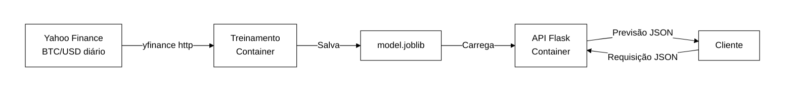
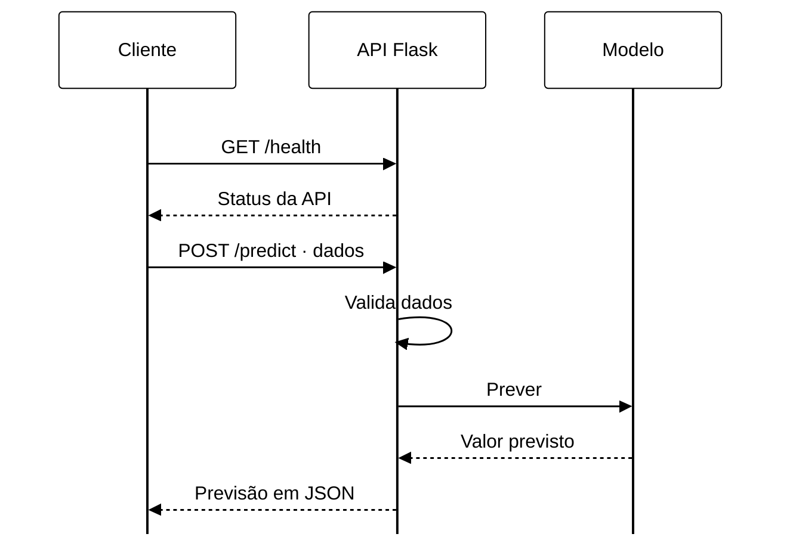
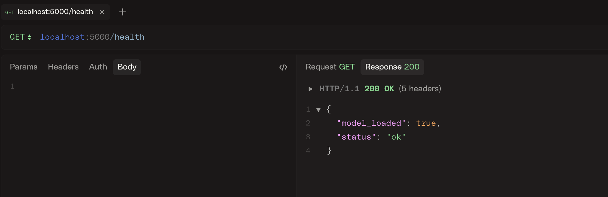
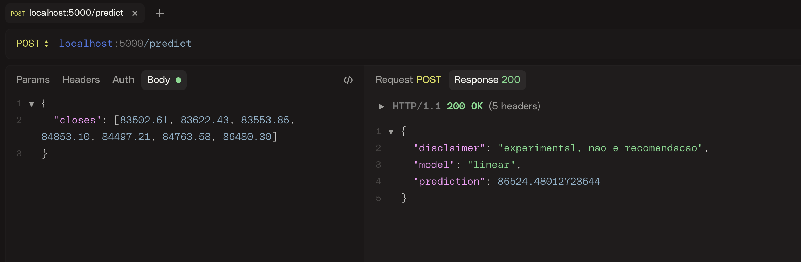
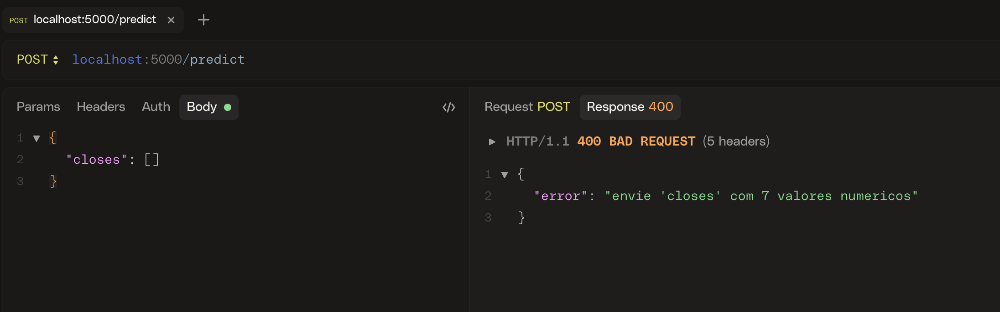
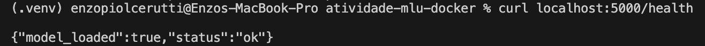
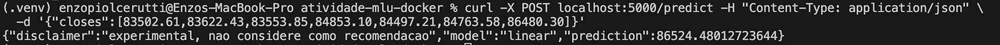
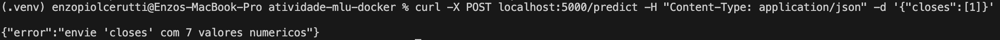

# Atividade ponderada M7: previsão do Bitcoin com Docker

**Nome:** Enzo Piol Cerutti
**Data:** 2026-10-05

Solução conteinerizada que treina um modelo para estimar o fechamento do BTC-USD no dia seguinte e o serve por um backend Python em outro container, acessado por `curl`.

## Índice
- [1. Arquitetura (UML)](#1-arquitetura-uml)
- [2. Como reproduzir](#2-como-reproduzir)
- [3. Devlog](#3-devlog)
- [4. Limitações conhecidas](#4-limitações-conhecidas)
- [5. Uso de IA](#5-uso-de-ia)

## 1. Arquitetura (UML)

### 1.1 Componentes e fluxo do modelo



O modelo chega ao container de inferência, o trainer grava model.joblib na pasta ./models do host. O backend monta essa pasta como volume somente leitura em /models e carrega o arquivo, fazendo com que o modelo não seja copiado para a imagem.

### 1.2 Diagrama de Sequência



## 2. Como reproduzir

Ordem seguida: **1) UML**, **2) treino**, **3) deploy com a API em Docker**.

**1. UML**

**2. Treino:**

```bash
docker compose --profile train run --rm --build trainer
```

**3. Deploy da API:**

```bash
docker compose up --build -d backend
docker compose ps
```

**4. Teste:**

```bash
curl localhost:5000/health
curl -X POST localhost:5000/predict -H "Content-Type: application/json" \
  -d '{"closes":[83502.61,83622.43,83553.85,84853.10,84497.21,84763.58,86480.30]}'
```

---

## 3. Devlog

Passo 1: no começo, li o enunciado para entender o que precisava entregar. Decidi prever o fechamento do Bitcoin no dia seguinte, fazer o treino em um notebook e usar Flask no backend. Com a interação sendo feita pelo curl.

Passo 2: antes de começar o código, pensei nos diagramas de arquitetura. Aí no diagrama de sequência, representei como o cliente consulta status health da API e envia os dados para receber uma previsão. Separei os containers em trainer, que executa o treinamento, e backend, que mantém a API disponível. Também decidi compartilhar o modelo pela pasta models, montada como somente leitura no backend para facilitar o versionamento.

Passo 3: minha primeira tentativa foi usar um dataset do Kaggle com preços a cada minuto, de 2012 a 2026. O csv era muito grande e precisava de uma preparação maior do que eu precisava para prever o dia seguinte. Transformei os registros em dados diários e selecionei três anos.

Passo 4: depois disso mudei a fonte para o yahoo finance e passei a baixar o histórico diário de bitcoin com yfinance. Isso evitou manter um csv grande no repositório, segui a orientação do professor de usar pelo menos dois anos de dados. O notebook considera só os dias completos, até o dia anterior, e salva uma cópia em data/btc_daily.csv como reserva caso a conexão falhe.

Passo 5: conferi a qualidade dos dados antes do treinamento. O conjunto final ficou com 730 registros, sem dias ausentes e sem valores nulos. Também coloquei a remoção de datas duplicadas por segurança e mantive os registros em ordem cronológica.

Passo 6: para a entrada do modelo, usei sete valores de fechamento anteriores à data prevista, com o fechamento do dia seguinte como alvo. Separei 80% para treinamento e 20% para teste, sem embaralhar, fiz isso para avaliar o modelo em um período depois ao usado no treino e respeitar a ordem da série temporal.

Passo 7: comparei regressão linear e random forest usando a janela de dois anos do yahoo finance, a regressão linear apresentou MAE de 1.035,79 e RMSE de 1.481,98 e o random forest apresentou MAE de 1.955,52 e RMSE de 2.450,33. Escolhi a regressão linear pelo menor erro no teste e exportei o modelo em models/model.joblib.

Passo 8: implementei o backend Flask com duas rotas. A rota GET /health que mostra o status do serviço e se o modelo está carregado. A rota POST /predict recebe um JSON com a chave closes e sete preços de fechamento (dias anteriores), e devolve a previsão. Configurei o retorno 400 para entradas erradas e 503 para modelo indisponível. Preparei os arquivos docker para separar o treino da API, então criei o dockerfile com a receita para criação da imagem.

Passo 9: subi o backend em container e testei a API com HTTPie e com curl. A consulta a GET /health retornou 200, com status: ok e model_loaded: true. A chamada com POST /predict, com sete fechamentos retornou 200, identificou o modelo como linear e fez a previsão de 86.524,48. As chamadas com lista vazia ou com apenas um valor retornaram `400`. Também confirmei que o processo estava rodando como usuário `app` e sem erros nos logs consultados, funcionando liso localhost.

O corpo usado no teste válido foi:

```json
{"closes": [83502.61, 83622.43, 83553.85, 84853.10, 84497.21, 84763.58, 86480.30]}
```

Registrei as evidências dos testes:













passo 10: ao analisar a resposta da API vi que a previsão de 86.524,48 ficou bem próxima de 86.480,30. Isso mostra que eu preciso avaliar melhor se gerar uma previsão próxima do preço recente não demonstra que o modelo consegue antecipar as mudanças do mercado, talvez comparar o erro com uma previsão simples que repete o último fechamento.

---

## 4. Limitações conhecidas

- O modelo usa só os 7 últimos fechamentos; não considera volume, notícias ou outros fatores.
- Em 2 anos de BTC, o preço mudou muito de patamar, o que prejudica modelos simples.
- Previsão de preço financeiro não é confiável para uso real.
- O treino depende de internet para baixar o Yahoo Finance (há cópia local de reserva em `data/btc_daily.csv`).

## 5. Uso de IA

Usei a IA como apoio neste projeto:

- Código: para o notebook de treino e backend Flask.
- Documentação: rascunho do README

Os testes, criação da imagem e container dockerfile, compose, a execução dos containers e as decisões finais foram feitos por mim.
