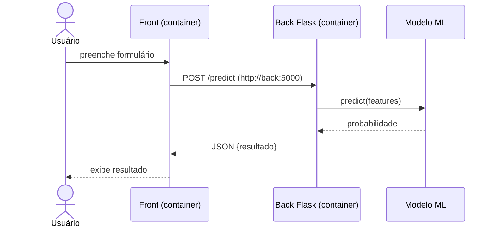

# 05 · Modelagem: UML e diagrama de sequência

## O que o professor enfatizou

- Técnica de modelagem usada: **UML**.
- Dois diagramas: **sequência** (foco) e **classes** (secundário, para representar componentes).

## Diagrama de sequência

Mostra a **ordem temporal das interações** entre elementos: quem faz a requisição, por onde ela passa, o que acontece depois.

**Para que serve (resposta esperada):**
1. Visualizar a **ordem em que as coisas deveriam acontecer**.
2. Facilitar **programar** (mapeia o fluxo antes).
3. **Localizar e depurar**: se na prática a ordem não bate com o diagrama, você acha onde está o erro.
4. **Alinhar entendimento**: o professor deu o exemplo de discutir se um serviço tinha API; cada um tinha um diagrama diferente na cabeça -> "estávamos falando de duas realidades".

## Elementos

- **Participantes/atores** (caixas no topo) e **linhas de vida** (tracejadas)
- **Mensagens**: seta cheia = chamada síncrona; tracejada = retorno
- **Barras de ativação**
- Fragmentos: `alt` (condicional), `loop`, `opt`

## Exemplo (Mermaid, renderiza no GitHub)

## Diagrama de classes (resumo)

Classes com atributos e métodos, e relações: associação, composição, herança, dependência. Usado para representar **componentes** do sistema.

## Treino

Desenhe, à mão, o sequence diagram do fluxo: usuário -> front -> back -> banco, e marque onde um erro de rede entre containers apareceria.
